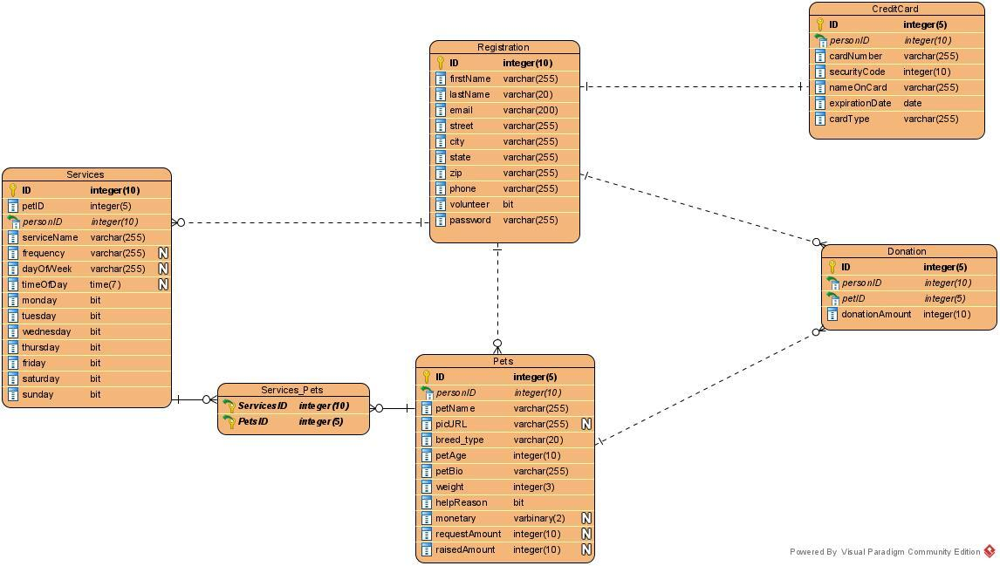

# Project2
**Petocracy (sp?)** A lil' CRUD app

## Team: SKOTU (Super Koders of the Universe)

Members:
- **EXPRESS** aka The Refactorer,  _alias Ashley_
- **SQL** aka Sir Schema, _alias John_
- **ELEMENT** aka Ms. DOM, _alias Ikra_

## Project Diagram

## ERD

## HTML Pages
* index.html - Home page for site.
    * Mission Statement
    * Buttons for:
        * Volunteer
        * Sponsor
        * Request Help
        * General Donation
    * Amount raised so far
    * Nav links: Login, Register
* registration.html - Page to create an account (volunteer / register pet)
    * Main Fields:
        * firstName
        * lastName
        * email (userid)?
        * street
        * city
        * state
        * zip
        * phone
        * volunteer (if selected, show volunteer fields. Otherwise, display Pet Fields)
        * password
    * Pet Fields (fields that display if registering pet)
        * petName
        * picURL (cloudinary upload)
        * breed_type
        * petAge
        * petBio
        * weight
        * helpReason
        * monetary (if selected, show monetary fields):
            * request amount
            * raisedAmount
* pet.html - Page to display all pets. Each pet has pic, name, sponsor button, donate button
* *volunteer.html* - Is this the page that displays when user clicks "volunteer" for a particular pet?
* login.html
    * email (userid)
    * password
    * *link to reset password?*
    * link to register.html (if no account)
* userprofile.html - Page to display pets associated with user and link to delete account
* *createaccount.html* - Is this the same as registration.html?
* aboutus.html - Page with team info
* Additional pages added by Ashley:
    * Donate pet page - Opens when user clicks "Donate" for particular pet
    * General Donation page - Allows users to submit general donations
    * Credit Card (Handlebars)? - Allow users to submit payment information for donations

## CRUD Operations
* **CREATE**
    * create user account
    * create pet account
* **READ**
    * view all pets
    * *view all volunteers*
    * *view all services*
* **UPDATE**
    * $ donated per pet
    * general donation
* **DELETE**
    * user delete account

## Routes
### HTML Routes
    * Home page ("/")
    * View all pets ("/pet.html")

### API Routes
    * View all users (Important to show delete functionality)
    * View all services
    * View all volunteers

## Technologies
* CSS Framework: Bootstrap / Bulma
* Additional packages:
    * Cloudinary (upload pet pics)
    * .env (hide API keys)
