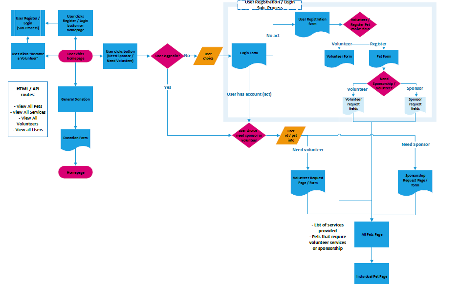
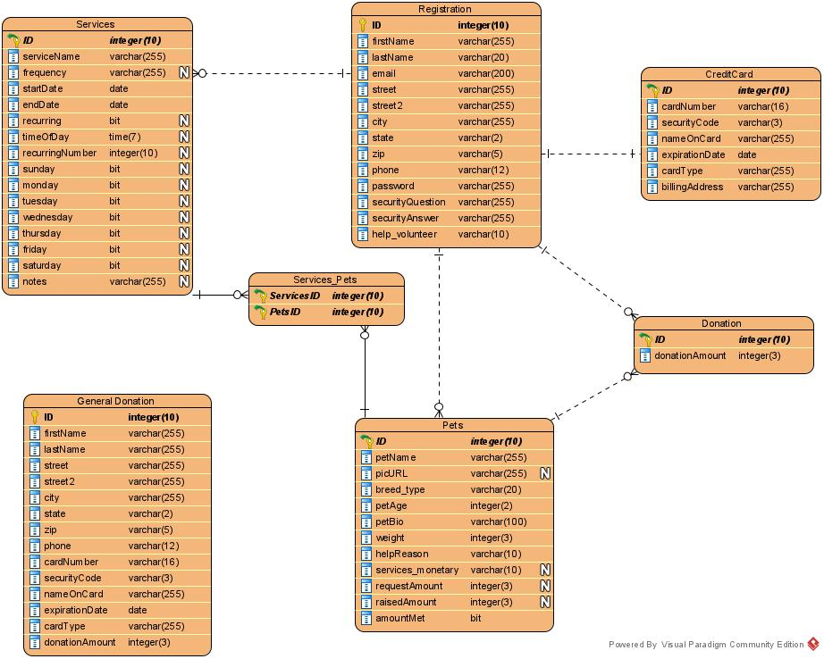
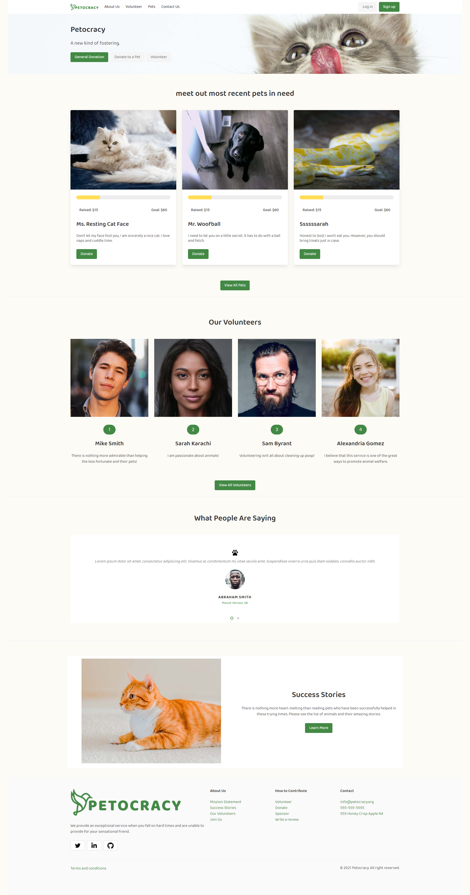
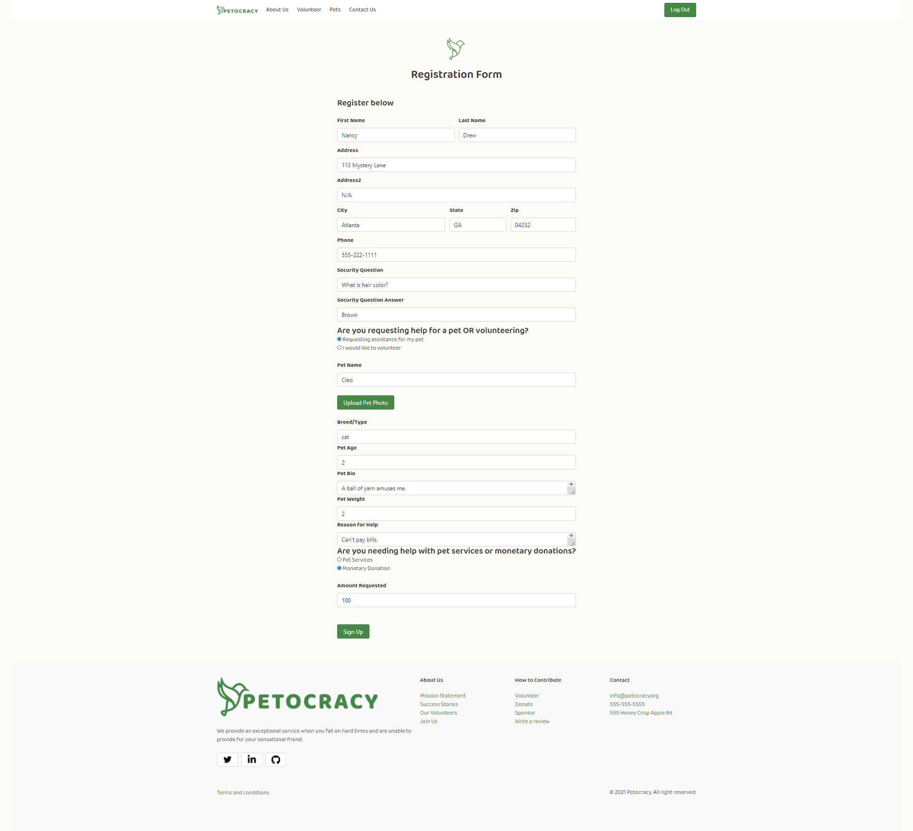
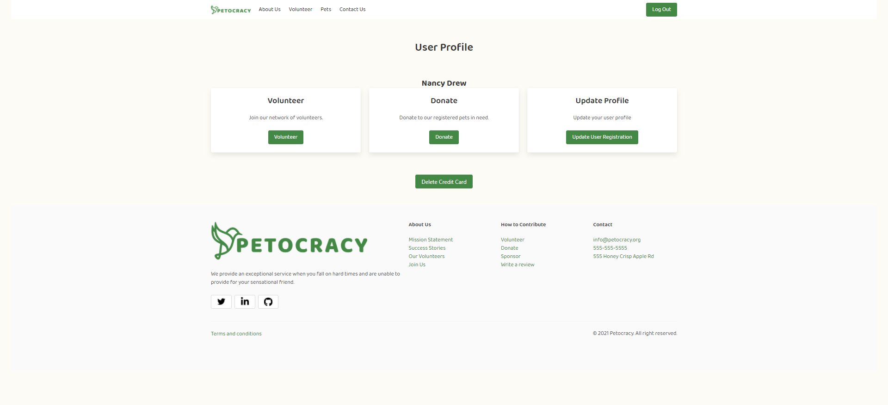
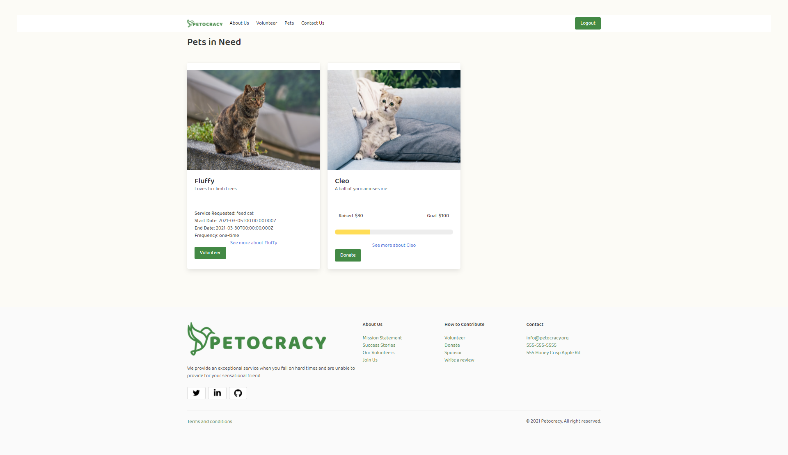
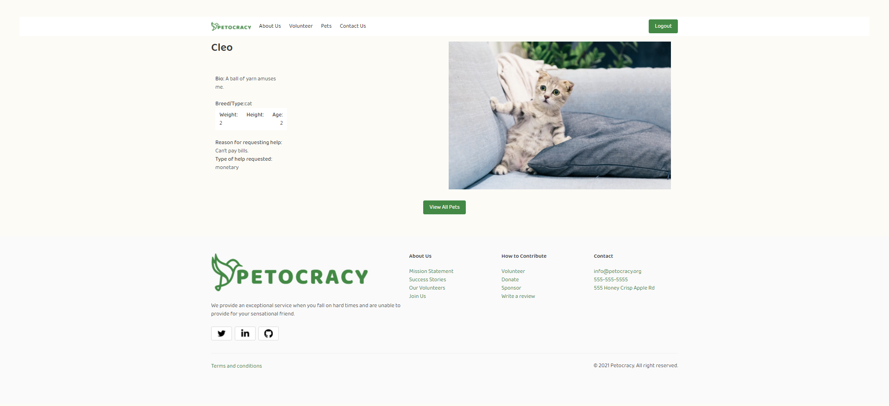
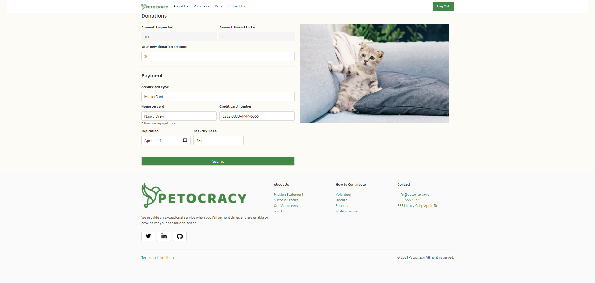
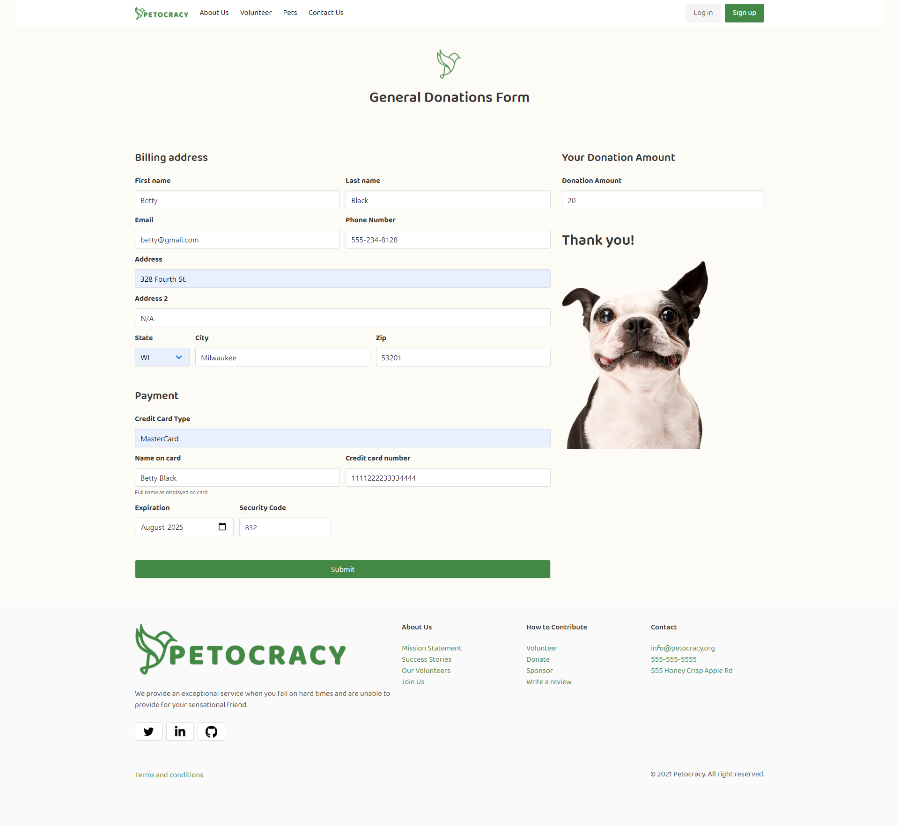
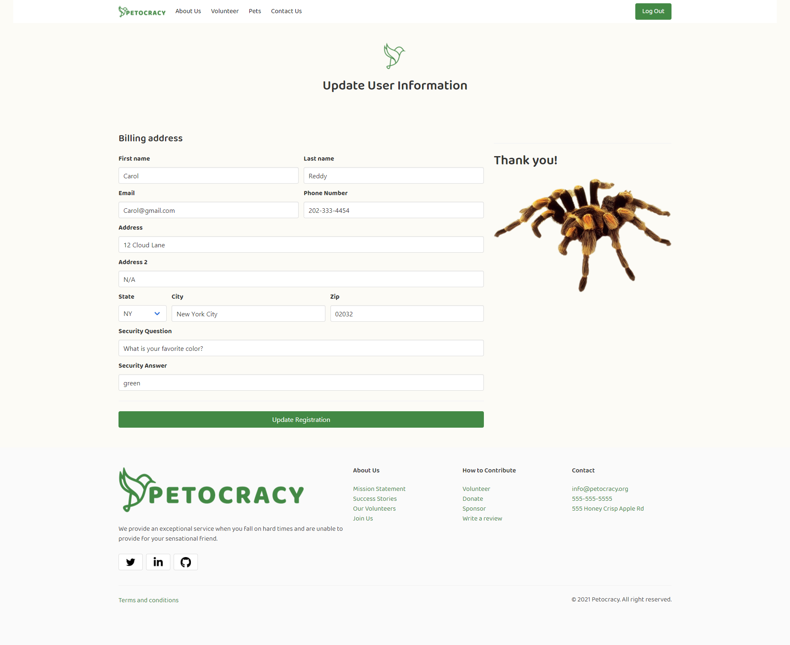

# Petocracy

Petocracy is an application designed to help out pet owners during the current Covid-19 crisis when people may be out of work and having a hard time paying bills.   Petocracy allows a pet owner to register as a user and request help from volunteers in either a monetary form or requesting help with services i.e. buying food, walking pet, housesitting, etc...   Any person can also register to be a volunteer to either sponsor the pet monetarily or volunteer to help out providing the specific need from the pet owner.  The application also allows the pet owner to upload a picture of their pet.   All the pets for either services requested or donations are displayed when a volunteer is trying to choose which pet to support.   A person who does not wish to register at the site can also just make a general donation to the cause to help out all pet owners.

This project demonstrates a full front end to back end application utilizing sequelize to perform all 4 of the CRUD operations.   It utilizes node.js and an express server for the back end while the front end utilized the Bulma framework.   Displaying the pet info to the user was accomplished through the use of the handlebar templating engine.  The project structure followed the MVC.  A mySQL database was incorporated and used with a sequelize ORM.  In addition, application has been deployed to Heroku.

The CRUD operations were incorporated through the use of registering a user, their pet info and services requested.  Those operations covered the Create.   The project also allowed the user to update their registration information which covered the Update.   The pet information registered by the pet owner was retrieved and displayed to a volunteer trying to decide between sponsor/donation or volunteering a service.   This operation covered the Read.  The project also allowed a registered user to delete their credit card information.   This operation covered the Delete.

New technologies incorporated into this project that the team had not used before include: Cloudinary, dotenv, bcrypt, and passport.  Dotenv was utilized to hide the keys for Cloudinary from the user by supplying only environment variables in the code that was deployed.  Passport was utilized to handle user authentication across the various html pages.  The application checks against the user being currently logged in before displaying some of the pages.   This was necessary because we needed a registered user for some operations on the website.  Bcrypt was utilized to hash the user password, the credit card number, credit card security code.  Lastly, cloudinary was incorporated to provide a way for the user to easily upload photos of their pets to the website.   These pet pictures are stored in the cloud at the cloudinary site, but the returned URL to the photo is stored locally in the Petrocracy database.    These URL links are used to display the pet pictures when people are viewing the pets to sponsor/donate.

## Table of Contents
* [Team](#Team)
* [Project Diagram](#Project-Diagram)
* [Entity Relationship Diagram](#ERD)
* [Screenshots](#Screenshots)
* [Installation](#Installation)
* [Usage](#Usage)
* [Support](#Support)
* [Technologies](#Technologies)
* [Repository](#Repository)
* [Deployment](#Deployment)

## Team: SKOTU (Super Koders of the Universe)

Members:
- **EXPRESS** aka The Refactorer,  _alias Ashley_
- **SQL** aka Sir Schema, _alias John_
- **ELEMENT** aka Ms. DOM, _alias Ikra_

## Project-Diagram

## Entity Relationship Diagram

## Screenshots
* [Home Page](#Home-Page)
* [Login](#Login)
* [Registration](#Registration)
* [User Landing](#User-Landing)
* [Display Pets](#Display-Pets)
* [Display Pet Info](#Display-Pet-Info)
* [Donate Pet](#Donate-Pet)
* [General Donations](#General-Donations)
* [Update User Registration](#Update-User-Registration)

#### Home Page
The following is a screenshot of the Petocracy application home page.

  

#### Login
The following is a screenshot of the login page.

  

#### Registration
The following is a screenshot of the registration page.

  

#### User Landing
The following is a screenshot of the user landing page.

  

#### Display Pets
The following is a screenshot of the display pets page.

  

#### Display Pet Info
The following is a screenshot of the display pet info page.

  

#### Donate Pet
The following is a screenshot of the donate to a pet page.

  

#### General Donations
The following is a screenshot of the general donations page.

  

#### Update User Registration
The following is a screenshot of the update user registration page.

  

## Installation

* Install node.js to computer, if not already present.
    * Node.js can be installed from [here](https://nodejs.org/en/)
* Copy all the application files locally to one's machine.
* In a terminal window where you copied the files, install 'cloudinary', 'sequelize', 'express-handlebars', 'dotenv', 'mysql2', 'express', 'bcrypt', 'bulma', 'express-session', passport, passport-local.    These installations are accomplished by performing the following command: 

    * **npm install**

## Usage

This application requires Node.js to be installed.  It also requires the user to have numerous npm packages installed.  (See [Installation](#installation) section.)  Once these items have been installed, the user can launch the application from a terminal window as follows:

**node server.js**

Followed by entering localhost:8080 in your browser URL line.

## Support

Please email any of the following team member for further information:

1.  **Ashley Stith**: email: ashleyc.stith@gmail.com; Github: https://github.com/stithac
2.  **Ikra Rafia**: email: irafi@nlihc.org; Github: https://github.com/ikra-rafi
3.  **John Toth**: email: jtoth7824@gmail.com; Github: https://github.com/jtoth7824

## Technologies

* CSS Framework: Bootstrap / Bulma
* Server: Express
* Database: mySQL
* Additional packages:
    * Cloudinary (upload pet pics)
    * dotenv (hide API keys)
    * passport (user accounts and authentication)
    * sequelize
    * bcrypt (hashing)
    * express handlebars (displaying pet info)

## Repository

Direct link to repository:  https://github.com/stithac/group1_project2

## Deployment

The Petocracy application was deployed to Heroku so that anyone can run the application.   The link to execute the application is as follows:

https://immense-coast-50151.herokuapp.com/
